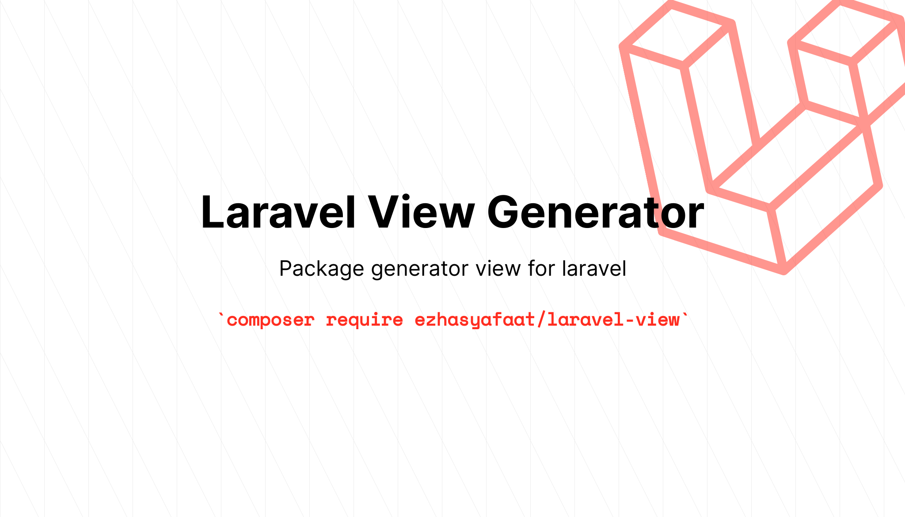

# laravel-view

[](LICENSE.md)
[]()
[](https://packagist.org/packages/ezhasyafaat/laravel-view)

<p align="center">
    
</p>

## Install
`composer require ezhasyafaat/laravel-view`

## Usage
```bash
$ php artisan vendor:publish --provider="Ezhasyafaat\LaravelView\LaravelViewServiceProvider"
```

`in file config/laravel-view.php you can customize your default extends and section for your blade view`

```php
<?php

/** Config file of laravel view */

return [
    
    /** Extends of your view file */
    'extends' => 'layouts.app',

    /** Section of your view file */
    'section' => [
        'content' => 'content',
    ],
];
```

```bash
$ php artisan make:view index
```

`this command will be generate file index.blade.php in folder resources/views`

```bash
$ php artisan make:view Product/index
```

`this command will be generate file index.blade.php in folder resources/views/Product`

```bash
$ php artisan make:view Product --resource
```


`this command will be generate a resource views`
- Product/index.blade.php
- Product/create.blade.php
- Product/show.blade.php
- Product/edit.blade.php


## Testing
Run the tests with:

``` bash
$ composer test
```

## Changelog
Please see [CHANGELOG](CHANGELOG.md) for more information what has changed recently.

## Contributing
Please see [CONTRIBUTING](CONTRIBUTING.md) for details.

## Credits

- [Muh Ezha Syafaat](https://github.com/ezhasyafaat)
- [All Contributors](https://github.com/ezhasyafaat/laravel-view/contributors)

## Security
If you discover any security-related issues, please email muhammadezhasyafaat08@gmail.com instead of using the issue tracker.

## License
The MIT License (MIT). Please see [License File](/LICENSE.md) for more information.

## Find me on :
- Instagram : zhaasyft
- Twitter   : zhaasyft
